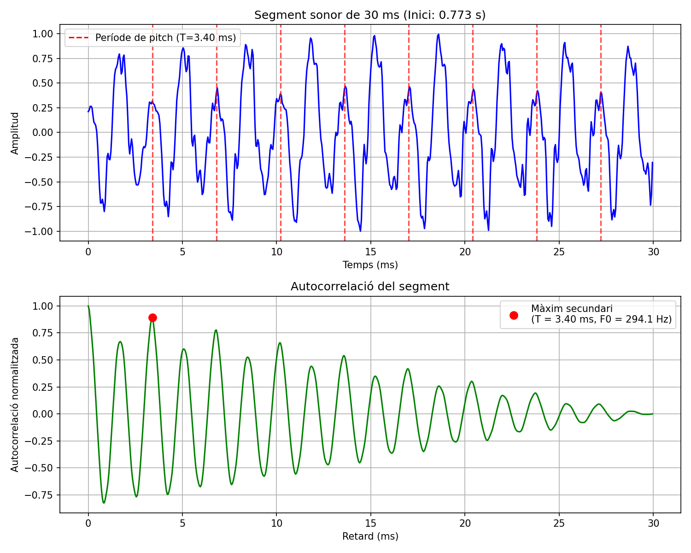
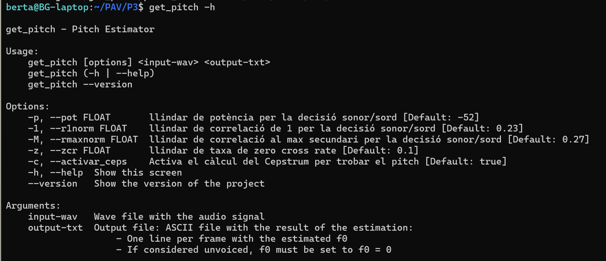

PAV - P3: estimación de pitch
=============================

Esta práctica se distribuye a través del repositorio GitHub [Práctica 3](https://github.com/albino-pav/P3).
Siga las instrucciones de la [Práctica 2](https://github.com/albino-pav/P2) para realizar un `fork` de la
misma y distribuir copias locales (*clones*) del mismo a los distintos integrantes del grupo de prácticas.

Recuerde realizar el *pull request* al repositorio original una vez completada la práctica.

Ejercicios básicos
------------------

- Complete el código de los ficheros necesarios para realizar la estimación de pitch usando el programa
  `get_pitch`.

   * Complete el cálculo de la autocorrelación e inserte a continuación el código correspondiente.
   
   ```cpp
      for (unsigned int l = 0; l < r.size(); ++l) {
             r[l]=0.0F;
            for (unsigned int n=l; n<x.size();n++){
              r[l] += x[n]*x[n-l];
            }
            r[l] = r[l]/x.size();  
    }
   ```
   * Inserte una gŕafica donde, en un *subplot*, se vea con claridad la señal temporal de un segmento de
     unos 30 ms de un fonema sonoro y su periodo de pitch; y, en otro *subplot*, se vea con claridad la
	 autocorrelación de la señal y la posición del primer máximo secundario.
    
    

	 NOTA: es más que probable que tenga que usar Python, Octave/MATLAB u otro programa semejante para
	 hacerlo. Se valorará la utilización de la biblioteca matplotlib de Python.

   * Determine el mejor candidato para el periodo de pitch localizando el primer máximo secundario de la
     autocorrelación. Inserte a continuación el código correspondiente.

    ```cpp
    for(iR= r.begin() + npitch_min; iR < r.begin() + npitch_max ; iR++){
        if (*iR > *iRMax){
           iRMax =iR;
         }
    }
    
    unsigned int lag = iRMax - r.begin();

    float pot = 10 * log10(r[0]);
    ```

   * Implemente la regla de decisión sonoro o sordo e inserte el código correspondiente.

    ```cpp
    if (r1norm > 0.6 || rmaxnorm > 0.6){
      return false;
    }
      return true;
    ```
    Implementación de la decisión sonoro/sordo (voiced/unvoiced):
     La señal se considera sonora (false) si la correlación de primer orden (r1norm) o la correlación en el máximo secundario (rmaxnorm) superan el umbral de 0.6. En caso contrario, se considera sorda (true).

   * Puede serle útil seguir las instrucciones contenidas en el documento adjunto `código.pdf`.

- Una vez completados los puntos anteriores, dispondrá de una primera versión del estimador de pitch. El 
  resto del trabajo consiste, básicamente, en obtener las mejores prestaciones posibles con él.

  * Utilice el programa `wavesurfer` para analizar las condiciones apropiadas para determinar si un
    segmento es sonoro o sordo. 
	
	  - Inserte una gráfica con la estimación de pitch incorporada a `wavesurfer` y, junto a ella, los 
	    principales candidatos para determinar la sonoridad de la voz: el nivel de potencia de la señal
		(r[0]), la autocorrelación normalizada de uno (r1norm = r[1] / r[0]) y el valor de la
		autocorrelación en su máximo secundario (rmaxnorm = r[lag] / r[0]).

		Puede considerar, también, la conveniencia de usar la tasa de cruces por cero.

	    Recuerde configurar los paneles de datos para que el desplazamiento de ventana sea el adecuado, que
		en esta práctica es de 15 ms.

      - Use el estimador de pitch implementado en el programa `wavesurfer` en una señal de prueba y compare
	    su resultado con el obtenido por la mejor versión de su propio sistema.  Inserte una gráfica
		ilustrativa del resultado de ambos estimadores.
     
		Aunque puede usar el propio Wavesurfer para obtener la representación, se valorará
	 	el uso de alternativas de mayor calidad (particularmente Python).
  
  * Optimice los parámetros de su sistema de estimación de pitch e inserte una tabla con las tasas de error
    y el *score* TOTAL proporcionados por `pitch_evaluate` en la evaluación de la base de datos 
	`pitch_db/train`..

##  Optimización de la estimación de pitch

  - Para maximizar la precisión del estimador de pitch, hemos ajustado los umbrales de decisión sonor/sord (unvoiced) a los valores óptimos de -52 dB para la potencia y 0.6 para las correlaciones (Correlación al primer desplazamiento (r1norm) y máximo de la autocorrelación secundaria (rmaxnorm)), además de implementar la ventana de Hamming.

    Originalmente, el sistema solo evaluaba la periodicidad mediante la autocorrelación. Hemos mejorado esto añadiendo un umbral de potencia que actúa como filtro previo para eliminar el ruido de fondo. Al descartar los fragmentos con baja energía antes de analizar la autocorrelación, hemos conseguido eliminar prácticamente todos los falsos positivos en las zonas de silencio o ruido.

    Además hemos cambiado la lógica cuando miramos la autocorrelación para detectar si es sordo o sonoro, ya que haciéndolo de la forma de antes (si el señal superaba el umbral se le asignaba como señal sonoro) era mucho más permisivo que haciéndolo al revés (si el señal no supera el umbral se asigna como sordo). 

    Esta nueva forma es mucho más robusta porque, para que un frame sea detectado como sonoro, ahora debe cumplir todas las condiciones simultáneamente (energía suficiente y alta periodicidad en ambos parámetros).

    Con estos cambios hemos pasado de un 64% a un 93%.

    Nueva regla de decisión:

      ```cpp
          if (pot < llindar_pot) {
              return true; 
          }

          if (r1norm < llindar_r1norm || rmaxnorm < llindar_rmaxnorm) {
              return true;
          }
          return false;
      ```


    Tabla con la tasa de error y el *score* TOTAL:

      **Num. frames: 11200 = 7045 unvoiced + 4155 voiced**

      | Métrica | Resultado |
      | :--- | :--- |
      | Unvoiced frames as voiced | 303/7045 (4.30 %) |
      | Voiced frames as unvoiced | 442/4155 (10.64 %) |
      | Gross voiced errors (+20.00 %) | 82/3713 (2.21 %) |
      | MSE of fine errors | 2.05 % |
      | **TOTAL SCORE** | **90.50 %** |

        ### Parámetros finales utilizados:
        * **Umbral de potencia (`-p`):** -49 dB
        * **Umbral de rmaxnorm (`-M`):** 0.36
        * **Umbral de r1norm (`-1`):** 0.36
        * **Ventana:** Hamming


      El porcentaje de Gross Errors es bastante bajo (2.21%) y el del MSE también (2.05%). Esto demuestran que el algoritmo es muy preciso y fiable cuando detecta la presencia de voz. Los errores de octava son mínimos. El error principal está en los Voiced frames as unvoiced (10.64%). Esto indica que el sistema tiende a ser conservador y etiqueta como sordos (f0=0) algunos segmentos que contienen voz, probablemente en zonas de baja energía o transiciones.


Ejercicios de ampliación
------------------------

- Usando la librería `docopt_cpp`, modifique el fichero `get_pitch.cpp` para incorporar los parámetros del
  estimador a los argumentos de la línea de comandos.
  
  Esta técnica le resultará especialmente útil para optimizar los parámetros del estimador. Recuerde que
  una parte importante de la evaluación recaerá en el resultado obtenido en la estimación de pitch en la
  base de datos.

  * Inserte un *pantallazo* en el que se vea el mensaje de ayuda del programa y un ejemplo de utilización
    con los argumentos añadidos.

- Implemente las técnicas que considere oportunas para optimizar las prestaciones del sistema de estimación
  de pitch.

  Entre las posibles mejoras, puede escoger una o más de las siguientes:

  * Técnicas de preprocesado: filtrado paso bajo, diezmado, *center clipping*, etc.
  * Técnicas de postprocesado: filtro de mediana, *dynamic time warping*, etc.
  * Métodos alternativos a la autocorrelación: procesado cepstral, *average magnitude difference function* (AMDF), etc.
  * Optimización **demostrable** de los parámetros que gobiernan el estimador, en concreto, de los que gobiernan la decisión sonoro/sordo.
  * Cualquier otra técnica que se le pueda ocurrir o encuentre en la literatura.

  Encontrará más información acerca de estas técnicas en las [Transparencias del Curso](https://atenea.upc.edu/pluginfile.php/2908770/mod_resource/content/3/2b_PS%20Techniques.pdf)
  y en [Spoken Language Processing](https://discovery.upc.edu/iii/encore/record/C__Rb1233593?lang=cat).
  También encontrará más información en los anexos del enunciado de esta práctica.

  Incluya, a continuación, una explicación de las técnicas incorporadas al estimador. Se valorará la
  inclusión de gráficas, tablas, código o cualquier otra cosa que ayude a comprender el trabajo realizado.

  También se valorará la realización de un estudio de los parámetros involucrados. Por ejemplo, si se opta
  por implementar el filtro de mediana, se valorará el análisis de los resultados obtenidos en función de
  la longitud del filtro.

  ## MEJORAS IMPLEMENTADAS
   Les millores mencionades a continuació han estat implementades de forma iterativa, és a dir, s'han anat afegint una a una i comprovant el seu efecte sobre el score total.

  ### Afegir ZCR com a nou paràmetre
    La primera millora probada ha estat afegir el parametre de zcr per poder evaluar millor si és tracta d'un so sonor o bé sord, ja que si la zcr és alta voldrà dir que es sord.
    
    Per tant s'ha modificat el programa per considerar un nou llindar anomenat llindar_zcr, tant al codi com al docopt, que se li ha atribuit un valor de 0.25 de default. A més a més cal tenir en compte que per poder evaluar diferents valors, s'ha hagut de : 
    
    * Afegir el "$@" a scripts/run_get_pitch.sh, línia  13, dins de la comanda que crida get_pitch:
    ```cpp
      $GETF0 "$@" $fwav $ff0 > /dev/null 
    ```
    * Per què cal "$@"?
     "$@" representa tots els arguments extra que li passes al script (--zcr 0.25, etc.). Sense això, el script executa get_pitch ignorant-los, i sempre usa els valors per defecte.
 
    * Així, quan fas ./run_get_pitch.sh --zcr 0.25, el --zcr 0.25 es passa  literalment a get_pitch abans dels fitxers d'entrada/sortida.

    Resultats després de fer run_get_pitch:
    ```cpp
          ### Summary
          Num. frames:    11200 = 7045 unvoiced + 4155 voiced
          Unvoiced frames as voiced:      271/7045 (3.85 %)
          Voiced frames as unvoiced:      459/4155 (11.05 %)
          Gross voiced errors (+20.00 %): 81/3696 (2.19 %)
          MSE of fine errors:     2.03 %

         ===>    TOTAL:  90.64 %
          --------------------------
    ```

    El seu efecte és petit perquè el pitch es mesura amb autocorrelació, i el ZCR només ajuda a la decisió sonor/sord (si el frame té pitch o no). Dona +0.3% de score, però per millorar l'estimació cal tenir en compte l'estimació directament.

  ### Docopt
    

    L'exemple d'us és el següent, on s'ha activat el cepstrum i s'han ajustat els llindars de zcr, potència i correlació per veure com afecta al score total:

   ```cpp
    run_get_pitch -c -z 0.10 --pot=-52 -1 0.23 -M 0.27 
    ```
    
  ### Cepstrum i Autocorrelació
    Hem usat el cepstrum per determinar sobre quinens mostres estaria el nostre pithc i d'alla calculem l'autocorrelació al voltnat d'aquelles mostres per tenir una cerca del pitch computacionalment més bona atés que calcular l'autocorrelació és més car, per tant quan menys mostres usem millor.

    Per no fer el canvi de forma permanent, s'ha creat una variable al docopt de forma boolean perqué l'usuari pogui escollir si desitja operar amb el cepstrum o amb l'autocorrelació. La variable usada ha estat:
     *-c, --activar_ceps    Activa el càlcul del Cepstrum per trobar el pitch [Default: false]*


    **A) Càlcul dels indexs del cepstrum**

    Per fer-ho, hem fet la funció cepstrum, la qual ha fet us de la llibreria FFT de Fastest Fourier Transform in the West (FFTW) per calcular la FFT i la IFFT. Aquesta funció segueix els passos següents:
     -  Zero Padding (cal fer-la amb mida potència de 2, tipus 2^ceil(log2(N)))
     -  |X| = sqrt(real^2 + imag^2)
     -  log(|X| + epsilon)
     -  IFFT del log-espectre
     -  c[n] = part real de la IFFT    

    ```cpp
       void PitchAnalyzer::cepstrum(const vector<float> &x, vector<float> &c) const {

      // Assegurar que N cobreix fins a lag=320 sense fer aliasing (N > 2*npitch_max)
      unsigned int N = 1024;
      while (N < x.size() * 2) N <<= 1;
      ffft::FFTReal<float> fft(N);
      // 1. Pre-èmfasi i Zero-padding
          vector<float> buf(N, 0.0f);
          buf[0] = x[0];
          for(unsigned int i = 1; i < x.size(); ++i) {
              buf[i] = x[i] - 0.97f * x[i-1]; // Filtre de pre-èmfasi
          }
        
      // 2. FFT
          vector<float> spec(N);
          fft.do_fft(spec.data(), buf.data());

      // 3. Log-magnitud (format packed)
          vector<float> logmag(N/2 + 1);
          for (unsigned int k = 0; k <= N/2; ++k) {
            float re = spec[k];
            float im = (k == 0 || k == N/2) ? 0.0f : spec[N/2 + k];
            logmag[k] = log(sqrt(re*re + im*im) + 1e-10f);
          }

      // 4. Omplir part real, imag = 0
          fill(spec.begin(), spec.end(), 0.0f);
          copy(logmag.begin(), logmag.end(), spec.begin());

      // 5. IFFT → cepstrum
          fft.do_ifft(spec.data(), buf.data());
          fft.rescale(buf.data());

      // 6. Copiar a c
          for (unsigned int i = 0; i < c.size(); ++i)
            c[i] = buf[i];
        }
    ```
    **B) Càlcul del pic del cesptrum o l'autocorrelació**

    Per estimar el segon pic del cepstrum o l'autocorrelació hem fet us del codi mencionat abaix, a més a més s'ha de tenir en conta que s'ha fet la funció perqué depenent de si l'activar_ceps està activa calculi el pitch a partir de la funció del cepstrum i en cas de que no ho estigui faci us de l'autocorrelació directament: 

    ```cpp
      bool usar_cepstrum = activar_ceps;
      iter = usar_cepstrum ? c.begin() : r.begin();
      for(iR= iRMax = iter + npitch_min ; iR < iter + npitch_max ; iR++){
            if (*iR > *iRMax){
              iRMax =iR;
          } }
      
      unsigned int lag = iRMax - iter; 
    ```

    **C) Càlcul del pitch desde el segon pic secundari**

    Hem fet us de la funció de cepstrum per trobar el pitch, seguint els següents passos:
       -  Calcular el cepstrum del frame amb la funció cepstrum mencionada en   l'apartat A)
       -  Localitzar el màxim secundari del cepstrum entre les posicions corresponents a 50 Hz i 500 Hz(lag entre 160 i 320)
       -  Calcular rmaxnorm = c[lag] / c[0] i r1norm = c[1] / c[0]
       -  Aplicar la regla de decisió sonor/sord amb els llindars corresponents tenint en compte el nou pitch calculat lag:

    ```cpp
        // Si hem usat el cepstrum, el pic d'autocorrelació pot estar lleugerament desplaçat.
        // Busquem el màxim local de l'autocorrelació al voltant del lag trobat.
        float r_max_val = r[lag];
        if (activar_ceps) {
            int search_range = 3; // Marge de cerca
            for (int k = -search_range; k <= search_range; ++k) {
                int current_lag = lag + k;
                if (current_lag >= 0 && current_lag < (int)r.size()) {
                    if (r[current_lag] > r_max_val) {
                        r_max_val = r[current_lag];
                    } } } }
    ```   
  
  **Resultats després de fer run_get_pitch -c:**
  ```cpp
    ### Summary
      Num. frames:    11200 = 7045 unvoiced + 4155 voiced
      Unvoiced frames as voiced:      165/7045 (2.34 %)
      Voiced frames as unvoiced:      668/4155 (16.08 %)
      Gross voiced errors (+20.00 %): 32/3487 (0.92 %)
      MSE of fine errors:     2.33 %

      ===>    TOTAL:  89.47 %
      --------------------------
  ```
    El resultat ha empitjorat envers al que teniem. 

 
  ### Optimització de paràmetres 
    Després de provar diferents combinacions de paràmetres i tècniques, hem arribat a la següent configuració final, que ens ha proporcionat un score del 91.29%:
    Hem fet us dels scripts : **grid_search.sh** i **grid_search_fine.sh** per provar diferents combinacions de paràmetres i trobar la millor configuració. 

    Com a resultat d'aquest procés, hem obtingut la següent configuració final:

    * **Umbral de potencia (`-p`):** -52 dB
    * **Umbral de rmaxnorm (`-M`):** 0.27
    * **Umbral de r1norm (`-1`):** 0.23
    * **Ventana:** Hamming
    * **Umbral de zcr (`-z`):** 0.10
    * **Activar cepstrum (`-c`):** true
    
    Tabla con la tasa de error y el *score* TOTAL:

    **Num. frames:    11200 = 7045 unvoiced + 4155 voiced**

    | Métrica | Resultado |
    | :--- | :--- |
    | Unvoiced frames as voiced | 217/7045 (3.08 %) |
    | Voiced frames as unvoiced | 382/4155 (9.19 %) |
    | Gross voiced errors (+20.00 %) | 31/3773 (0.82 %) |
    | MSE of fine errors | 2.94 % |
    | **TOTAL SCORE** | **91.29 %** |

     Aquesta configuració ha estat obtinguda després d'un procés iteratiu d'ajust dels paràmetres i l'addició de tècniques de preprocesat (filtre pas-baix) i postprocesat (filtro de mediana). 

     El preprocesat amb filtre pas baix ajuda a reduir les discontinuïtats al principi i al final del frame, millorant la qualitat de l'estimació del pitch. El postprocesat amb un filtro de mediana ajuda a suavitzar les estimacions i eliminar los outliers, reduciendo los errores grossos.


   

Evaluación *ciega* del estimador
-------------------------------

Antes de realizar el *pull request* debe asegurarse de que su repositorio contiene los ficheros necesarios
para compilar los programas correctamente ejecutando `make release`.

Con los ejecutables construidos de esta manera, los profesores de la asignatura procederán a evaluar el
estimador con la parte de test de la base de datos (desconocida para los alumnos). Una parte importante de
la nota de la práctica recaerá en el resultado de esta evaluación.
